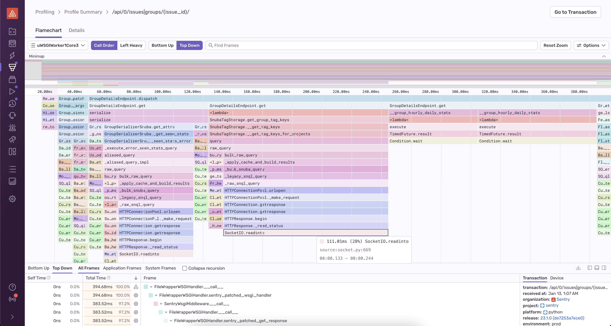
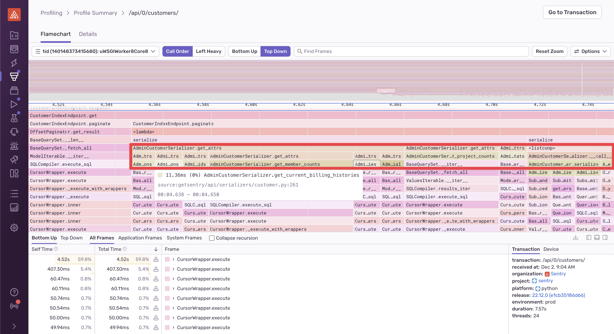
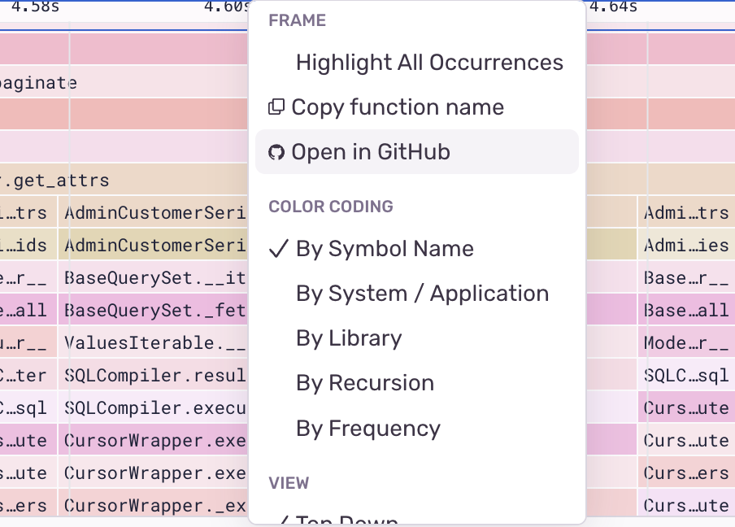

## Intro

This is part 2 of a 3-part series on profiling. If you’re not yet familiar with the what profiling is, check out the first part in our series. Already know you want to profile your code, just don’t know where to get started? Jump ahead to part 3.

- [Part 1: What is profiling?](../posts/profiling-101-pt-1.html)
- Part 2: Why profiling? (You are here!)
- Part 3: Profiling tools and how to use them (Coming soon!)

By this point, you’re probably already convinced that good performance is important for your app’s success. There are many tools available for performance, but profiling in production with a modern profiling tool is one of the easiest and most effective ways to get a full understanding of your app’s performance.

While profiling tools have been helping developers fix slow code since the 1970s, modern profiling tools are more sophisticated and easier to use. They can run continuously for the lifetime of a service, automatically create useful visualizations to show you slow code paths, and they play nicely with other performance tools.

As with pt. 1, most examples we’ll use in this post are about frontend and backend development, but profiling tools can help you improve the performance of almost any type of code.

## Why profile in production?

Many languages have built-in profiling tools, like Python’s [cProfile](https://docs.python.org/3.7/library/profile.html#module-cProfile) or Go’s [pprof](https://pkg.go.dev/runtime/pprof). These tools are convenient and have been in use for decades, but they’re often clunky to use, require an additional visualization tool, and are only meant to be run locally on your machine.

### Local profiling is limited

Built-in profilers are are great for helping you get detailed benchmarks for specific parts of your code to find hot spots, but they’re not appropriate for finding performance problems in a larger-scale system. Local profilers usually add a lot of overhead to your code, >200% is considered normal. If you care enough about your code’s performance to profile it, you probably aren’t okay with making it twice as slow. And as with all profilers, the amount of overhead added isn’t consistent between function calls. This means the wall-clock times you get back from the profile aren’t accurate in production and aren’t even very accurate relative to one another.

In general, you can’t get a clear picture of what users are experiencing by just profiling locally. It’s very hard to locally recreate what causes slowdowns in production, as what’s happening on your dev machine isn’t representative of real-world workload. “It’s fast on my machine” doesn’t help your users when they’re staring at loading spinners.  Maybe only specific queries slow down your app or your algorithm is only slow for certain inputs. It is very hard to find and fix these kind of issues with local profiling alone.

### Modern profiling in production

Ultimately, measuring performance in production is the only way to accurately understand your system’s performance. Fortunately, profiling technology has come a long way since local profiling tools were created. Modern statistical profilers (<statistical vs. deterministic profilers are covered in more detail in part 1>) are now advanced enough to run in production with low overhead while still giving you a view into your code’s performance that’s granular enough to be useful. For example, Sentry’s profiling tools target <10% overhead.

In addition, modern profiling tools are designed to be long running, i.e. capturing data across all user sessions. This means you’re able to get a comprehensive view of how your code is performing in the wild.

## How does profiling compare to <metrics/logging/tracing>?

“Why should I set up profiling if we’re already getting performance data in production from <insert tool here>?” No one wants to overhaul the way they monitor performance. Fortunately, Profiling complements other strategies for measuring performance and isn’t usually too hard to set up. And the benefits are great: profiling data provides a function or line level of granularity that makes it much easier for devs to find and fix performance problems.

### **System metrics**

Page load times, CPU usage and other preconfigured metrics provide an effective, low-overhead way to see the big picture of your performance in production. Metrics are great for informing you that your system is having issues (performance and otherwise) but can’t do much to help you figure out why. Metrics are so low-overhead that there’s no reason not to use them, but their usefulness is limited when compared to more modern tools.

### **Logging**

Logging is helpful for understanding your system’s health in many ways, including performance. However, getting performance data from logging requires a lot of manual work to add events everywhere you’re interested in, and logs can be expensive to collect, depending on how you’ve set up your logging system. Tracking and analyzing your logs to understand the relationship to code flow across a distributed system can also be challenging and time-consuming.

### **Tracing**

<Check out part 1 for an explanation of how profiling is different than distributed tracing.>

If you’re monitoring your app’s performance using distributed tracing, using something like Zipkin, Jaeger, Grafana Tempo, or even (whispers) Sentry, you’re doing better than most. And while tracing is great for showing where time is being spent across your services and external calls, the information it can give you is only as granular as the spans you’ve manually instrumented. Profiling complements tracing by giving file and line level detail about where hot spots are, without having you instrument every function. Later in this article, we cover some of the benefits of using profiling and tracing together.

### Profiling’s advantages

When there’s a performance issue in production, you want your tools to let you know and point you to exactly where in your code the problem is so you can fix it. This is where profiling comes in.

Since modern CPU profilers collect profilers by sampling the callstack many times per second to determine how long each function takes to run, they’re able to get extremely detailed data about where your code is slow without adding a ton of instrumentation. And since your profiler is running in production all the time, you’ll automatically have data about the slowdown that only happens to your boss, every February 29th during leap year.

The data you get back from your profiler allows you to dig into the call stack for hotspots, showing you details about exactly where your code spent time, down to the line number. Often this data is represented with flame charts or flame graphs (you can learn more about what these are and how to interpret them in part 3 <LINK>). Here’s an example of a flame chart from Sentry’s Python profiler, where you can hover over a function to see the callstack of what’s running, the amount of time each function ran for, and the line number.

## Using profiling and tracing together

At Sentry, we believe that profiling and tracing work better together. Tracing gives you a high-level view of your system’s performance while profiling fills in the details, allowing you to drill down to an exact line number when working to root cause a slowdown.

With Sentry’s tools, many frameworks even support auto instrumentation for tracing. This means that you can get started with tracing by just adding a few lines of code — no custom instrumentation necessary. If you enable profiling as well, Sentry’s transaction-based profiler will automatically collect profiles for the auto-instrumented transactions and link the profiles and transactions together. This provides a straightforward mental model for exploring and understanding your performance data. You can easily navigate from a higher-level transaction view to function-level details in a profile and back again, all in one cohesive view.

Let’s walk through a short example of using tracing and profiling to explore a CPU-intensive workload using an example from one of Sentry’s APIs (yes, we use Sentry to monitor Sentry). Here’s a transaction from our `/customers` endpoint:

The transaction data shows that when paginating `CustomerIndexEndpoint`, a significant amount of time is spent in `AdminCustomerSerializer`. We can see the raw database queries contributing to this time below that, but it’s difficult to understand where in the code these queries are being executed.

If you jump into the profile data, you can see this:

From here, it’s easy to identify functions like `AdminCustomerSerializer.get_member_counts` and `AdminCustomerSerializer.get_current_billing_histories`, which are the places in the code that the SQL queries are being executed from (as you can see by reading further down the function call stack to `CursorWrapper.execute`). From here, you can click on a frame and **Open in GitHub** to navigate [directly to the code:](https://github.com/getsentry/getsentry/blob/304934998467b3d3226413a52c5ce652d1e9aa69/getsentry/api/serializers/customer.py#L53)

## Conclusion

Profilers are incredibly useful tools for identifying code hot spots, whether used locally or in production. However, using a long-running modern profiler in production is the easiest way to:

1. Accurately understand what your users are experiencing
2. Get actionable information to start fixing performance problems
