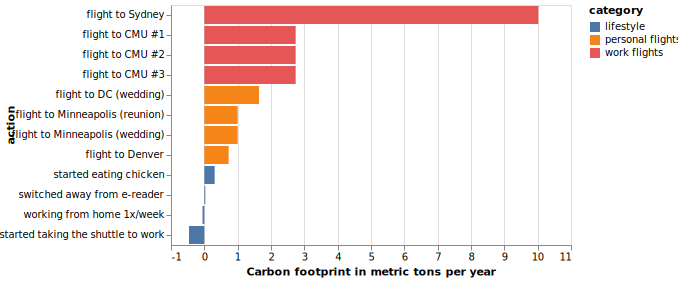
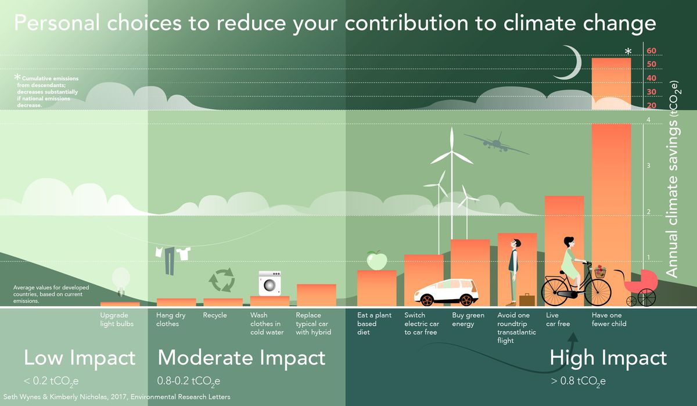

2019 marked a change in the global discussion of climate change and carbon emissions. I've been conscious of my impact for a while and generally tried to make good choices. However, while reflecting on my 2019, I realized I needed to do more.

I think of myself as a logical problem solver, but I've been approaching the problem of my environmental impact from an emotional standpoint. I feel *guilty* for having a negative impact on the environment and to alleviate this guilt, I do things that *feel* like they help, like eating less meat, buying from "eco-friendly" retailers, and avoiding single-use plastics.

Not to say that these aren't fantastic things to do (I continue to do them), but I had a sneaking suspicion that those weren't the actions that had the most impact. I chose them because of how they made *me* feel, not the benefit they had on the planet.

For 2020, I decided to take a more data-driven approach to the problem of my carbon footprint. That starts with understanding what impact my current actions have, so I can make improvements that have the most benefit. As a start, I did research to determine the relative impact of some of the choices I made in 2019.

Before I get into it, I want to give a couple of disclaimers:

1. There's some controversy about whether or not individual actions matter at all[^1] and whether discussing the impact individual actions may actually be harmful. Some research indicates that emphasizing individual solutions to big issues can reduce support for government efforts[^2]. That being said, I am still of the opinion that individual efforts can be worthwhile if done correctly, so I want to share mine.
1. I decided to start with data about my carbon footprint because that's the easiest thing to quantify. I'm open to feedback about other types of impact I should be measuring.

To get started, I researched the carbon footprint of a selection of things I did during 2019, both positive and negative. This helped me get a feel for what actually made a difference. Once I started researching, the answer became clear very quickly.

## the carbon footprint of some things I did in 2019

*Bar chart displaying my 2020 carbon emissions in metric tons per year.*

Some actions matter a lot more than others, and at least for me, it's not the ones that *feel* particularly good (or bad).

I flew from Seattle to Sydney for work, business class (yes, cabin kind of makes a difference[^3]), in the fall of 2019 to deliver a workshop about Python and data science. Everything else I did last year, good or bad, was almost negligible compared to that one round-trip flight.

In 2019 I also made the change from being totally vegetarian to eating some meat (pretty much only chicken) and felt really guilty about it. It turns out I shouldn't have. Every flight I took, even the small hop from Seattle to Denver (in economy), was *more than double* the impact of me eating chicken all year long.

In contrast, I also felt really good about cutting down dramatically on my car use by taking transit into work every day. It turns out... I shouldn't have. While exclusively taking transit to work more than made up for me eating chicken, it didn't matter compared to my 3 different flights from Seattle to Pittsburgh (again, business) for work.

I'd seen this infographic around the internet:

*[Source: Environmental Research Letters](https://iopscience.iop.org/article/10.1088/1748-9326/aa7541/meta)*

And I "knew" that flying was bad. But it took me creating the above graph about my own life and choices to really get it.

People can't be perfect. Sometimes we have to fly! To really make a difference, the system needs to change. But as an individual motivated to do my part, the actions I should take to help are very obvious.

I've committed to flying less in 2020, especially for work, and encouraging my teammates to do the same.

## the boring stuff

### how I calculated my carbon footprint

- **Flights**: <https://calculator.carbonfootprint.com/calculator.aspx?tab=3>

    Work flights were business, personal as premium economy or economy. I didn't calculate my connections, just origin direct to destination, so most of my numbers are actually underestimates.

- **Starting to eat chicken**: <https://www.vox.com/2014/7/2/5865109/study-going-vegetarian-could-cut-your-food-carbon-footprint-in-half>

    I got this number by calculating myself as a "low-meat" diet person vs. a "vegetarian" with the per-day numbers given, multiplying out to a year and converting to metric tons.

- **Commuting**: <https://calculator.carbonfootprint.com/calculator.aspx?tab=4>

    My commute is 23 miles round trip (annoyingly long, I know. My fault for wanting to live in the "cool" neighborhood). I got this number by calculating the difference between driving that and using a "coach" - provided by my employer (and always full). I'm also lucky enough to work from home 1x/week and calculated that footprint simply by determining what 1/5th my commuting footprint is.

- **Books**: <https://onlinelibrary.wiley.com/doi/abs/10.1111/j.1530-9290.2011.00414.x>

    I also embraced my love for physical books last year, rather than using my e-reader. I still primarily use my local library and buy used, but I do buy new books from time to time. I found this very interesting calculation and decided to include it. I arrived at my yearly number by multiplying the footprint of one book by 12 (an overestimate, I buy fewer new books than this) and converting to metric tons.

### a quick note on carbon offsets

the tl;dr is that the majority of carbon offset projects don't pan out [^4]. They mostly serve as a feel-good "pass" for individuals and companies to use carbon, guilt-free. Maybe I'll write about it!

### recommended reading

- A basic primer on climate change and carbon: <https://www.nytimes.com/interactive/2017/climate/what-is-climate-change.html>
- A great writeup about what individual choices are impactful: <https://www.vox.com/energy-and-environment/2017/7/14/15963544/climate-change-individual-choice>
- Individual vs. corporate action for climate change: <https://www.resilience.org/stories/2018-01-10/individual-vs-collective-are-you-responsible-for-fixing-climate-change/>
- The in-depth version of the Vox article: <https://iopscience.iop.org/article/10.1088/1748-9326/aa7541/meta>

### source code

View the code for how I did my analysis & created my carbon footprint visualization as a Gist [here](https://gist.github.com/shanamatthews/63dbda8ab197db9687b90d5f6d5907e9).

## I (try to) cite my sources

[^1]: https://www.nytimes.com/roomfordebate/2012/07/30/responsible-shoppers-but-bad-citizens/individual-actions-just-dont-add-up-to-environmental-change
[^2]: https://phys.org/news/2017-06-emphasizing-individual-solutions-big-issues.html
[^3]: https://www.theguardian.com/environment/blog/2010/feb/17/business-class-carbon-footprint
[^4]: https://features.propublica.org/brazil-carbon-offsets/inconvenient-truth-carbon-credits-dont-work-deforestation-redd-acre-cambodia/