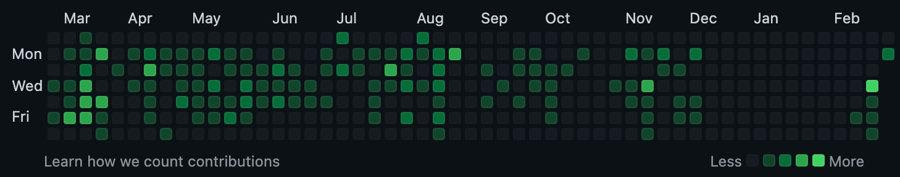

Trying out writing week notes again! 👯‍♀️

I'm not making kombucha anymore (rip) and barely knitting, so sadly I can't continue my previous format from 2020. I'll try out some sections this week and see how they feel.

## Projects

I've been in a personal-projects slump recently, as evidenced by my GitHub activity chart, yikes.

This is mostly because of some health stuff that came up early in January and I'm still dealing with. However, I've been doing better over the last couple of weeks and I've found some energy and excitement to start playing around, particularly with ChatGPT-related things.

### This website

Read my [writeup on adding a new feature to this site](./chatgpt-site-improvements.html) with the "help" of ChatGPT.

### ClippyGPT

I read [this super cool article](https://supabase.com/blog/chatgpt-supabase-docs) this week about Supabase adding ChatGPT to answer questions based off their docs.

They created such a nice writeup and video of the process, I wanted to play around with a similar setup in [Sentry's docs](https://docs.sentry.io/).

I didn't get very far because our docs our on a very old version of Gatsby (2.32.13, yikes), which is not compatible with Supabase. I figured rather than trying my luck with other postgres DBs that might support both [`pgvector`](https://github.com/pgvector/pgvector) and Gatsby v2, I'd just set up a proof of concept by copying our docs markdown files into a newer project and set up Supabase with that project.

I decided to try [Markdoc](https://markdoc.dev/), since I've been wanting to play with it more since my first experiments with it at Coinbase. However, we use .mdx files, Mardoc only supports it's own flavor of markdown... whew. It quickly turned into a lot, as these things often do.

This is still a work in progress. Hopefully more updates next week!

## Writing

- [started] "What is OpenTelemetry" article with another DevRel person from GCP.
- [paused] Dreaming of finishing my Profiling 101 series (someday 💭)

## Reading

Articles I liked this week:

- [Harder Drive: Hard drives we didn't want or need](http://tom7.org/harder/), also in [video form](https://www.youtube.com/watch?v=JcJSW7Rprio&ab_channel=suckerpinch)
- [What Is ChatGPT Doing … and Why Does It Work?](https://writings.stephenwolfram.com/2023/02/what-is-chatgpt-doing-and-why-does-it-work/)

Books:

- [started] [My Grandmother's Hands](https://openlibrary.org/works/OL19718843W/My_grandmother%27s_hands?edition=ia%3Amygrandmothersha0000mena)
- [started] [By Blood](https://openlibrary.org/works/OL16239773W/By_blood?edition=ia%3Abyblood0000ullm_u3v1)
- [in-progress] [Moby Dick](https://openlibrary.org/works/OL21501229W/Moby_Dick?edition=ia%3Amobydick0000melv_c9t5)
- [in-progress], [reread] [Return of the King](https://openlibrary.org/works/OL27516W/The_Return_of_the_King?edition=ia%3Aleretourduroi0000tolk)
- [paused] [Spare](https://openlibrary.org/works/OL29240850W/Spare)
- [paused] [Unsettled Ground](https://openlibrary.org/works/OL25758323W/Unsettled_Ground)
