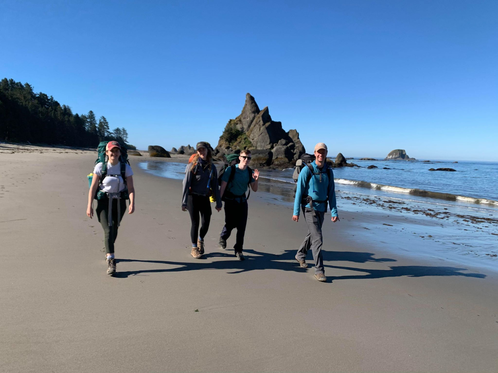
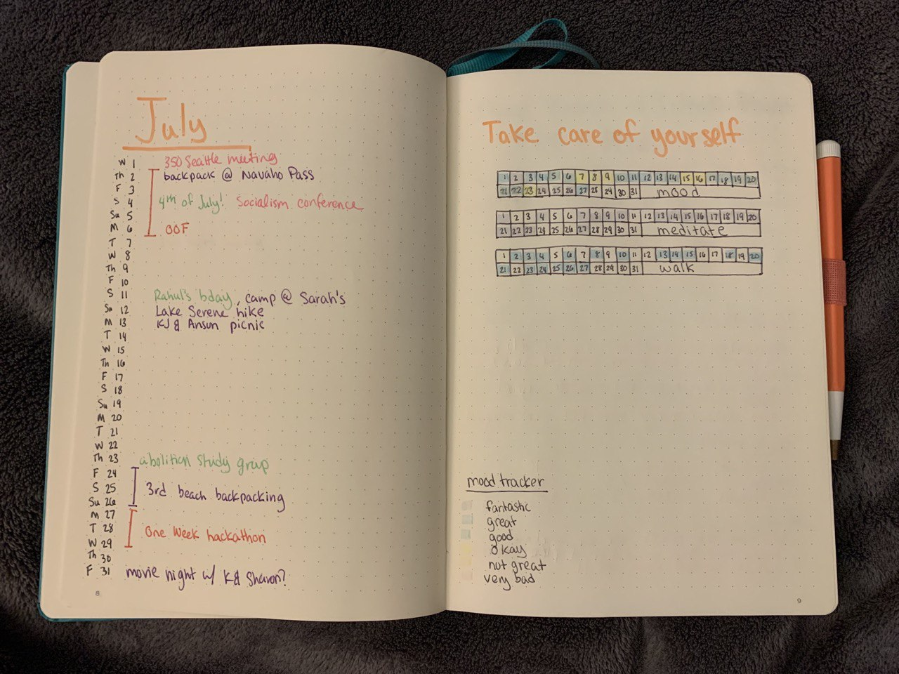

Hello friends!

Coming at you again after another long weekend, courtesy of a vacation day used on Friday 7/24.

Myself, the boyfriend, and a few friends went backpacking from [Third Beach](https://www.wta.org/go-hiking/hikes/third-beach) to [Toleak Point](https://www.wta.org/go-hiking/hikes/toleak-point) on the coast this weekend and had a blast. I did this same trip last year with a similar group of friends and had the best time. We've been wanting to go back, but Third Beach has been closed most of the year due to coronavirus precautions. When it finally opened back up, I grabbed backpacking permits right away!

One of my friends took an amazing photo of the milky way from the beach (while I went to sleep 😅)

Overall it was an amazing trip and I'm sure I'll go back again soon!

In other news, I've gotten back into (bullet-ish) journaling. It's mostly normal journaling, in a fancy dotted notebook, with some inspiration from [Bullet Journaling](https://bulletjournal.com/), like keeping it short in your daily and expanding in a different section later, and keeping a table of contents. I'm not that artsy, but here's an example of a monthly layout for me:

# Knitting

After the wild success of my last [Slouchy Hanging Basket](https://www.ravelry.com/patterns/library/slouchy-hanging-baskets), I decided to make another!

I'm not too far into it yet, but the idea is to use up a bunch of stash yarn I've probably had for a decade (yikes) and don't want to use for a garment.

I'm still putting off making my [Knitorious RBG](https://www.ravelry.com/patterns/library/knitorious-rbg) because I know it is going to be a PROJECT. It's also super hot here (90°F right now) and working on a sweater doesn't sound so appealing.

I've been really enjoying my crop tops at home in the heat (with no AC), so I'm thinking my next project might be [The Pamela Bandeau](https://www.ravelry.com/patterns/library/the-pamela-bandeau)...

# Reading

- [finished] [*The Hollow of Fear*](https://www.goodreads.com/book/show/36342330-the-hollow-of-fear). This was so good!! My favorite yet of the series. I'm not sure why this series was a slow start for me, but I'm super glad I've stuck with it. No spoilers, but the series *finally* took the turn I've been wanting it to make all along, and I feel that Charlotte was her most fleshed-out, badass, and real yet. I CANNOT wait to get my hands on the next one!

- [finished] [*The Amber Spyglass*](https://www.goodreads.com/book/show/18122.The_Amber_Spyglass) on audiobook. Okay, this was a pretty big disappointment. The series overall started strong, but took a downward dive quickly. I wasn't a huge fan of the second book, but I thought the finale might redeem it. It did not. The world-building was just not there, and the plot was all over the place. Even the religious themes, far from improving the books, felt underdeveloped and begrudging. Why was this series so popular?

- [finished] [*My Not So Perfect Life*](https://www.goodreads.com/book/show/30821598-my-not-so-perfect-life). I saw this going around on Bookstagram a while back and I put a hold at my local library. I finally decided I was ready for a nice breezy read and finished it in a couple of sittings. It was really fun and cute!

- [finished] [*Dream Hoarders*](https://www.goodreads.com/book/show/29502567-dream-hoarders). I heard about this book from [an interview with the author from the Aspen Institute](https://youtu.be/pTgpgMzs5sU). The author seemed fun and the message seemed interesting, so I thought I'd give the book a try. It was a pretty quick read, and overall I wasn't *that* impressed. Reeves argues that the upper middle class are pulling away from the lower middle class, reducing social mobility. While those arguments seemed valid, he was also intent on arguing that this split between the lower and upper middle classes was a larger issue than the super-wealthy 1%. Unfortunately, no data he laid out in the book convinced me that this was the case. I finished the book convinced that there is a moral imperative to put measures into place that improve social mobility between the lower and upper middle classes, but the 1% are still the ones buying elections and I refuse to release them from responsibility.

- [in-progress] [*A Game of Thrones*](https://www.goodreads.com/book/show/13496.A_Game_of_Thrones). The boyfriend decided he didn't really want to read this series after all, so I'm on my own! Fine by me, I'm due for another (slow) reread 😝

- [in-progress] [*So You Want to Talk About Race*](https://www.goodreads.com/book/show/35099718-so-you-want-to-talk-about-race) on audiobook. About halfway through this one, and enjoying it quite a bit so far. I'm finding parts of it a bit basic, especially in comparison to [*How to Be an Antiracist*](https://www.goodreads.com/book/show/40265832-how-to-be-an-antiracist), which I LOVED, but I'd recommend it to folks who are new to the ideas of structural racism.

- [in-progress] [*The Sword of Shannara*](https://www.goodreads.com/book/show/15575.The_Sword_of_Shannara) I'll admit, I'm only reading this because I was craving a nice physical read. I've had it on my shelf for *years* and never bothered to get into it. My mom liked this series, and there was a (bad) TV adaption a few years ago, so I bought a copy, but I'd heard that it was basically a bad clone of *The Lord of the Rings* series and I never started it. So far, I'm actually liking it! The LoTR comparisons are obvious and easy to make, but I'm trying to just take the book for what it is - some fun fantasy!

- [in-progress] [*Little Fires Everywhere*](https://www.goodreads.com/book/show/51704136-little-fires-everywhere). This was another Bookstagram book that I wanted to check out. I'm about a third of the way through and enjoying it pretty well. I like the family dynamics and air of slight mystery, but I'm not loving how much it focuses on motherhood and mother/daughter relationships. Just some hangups from my own life, nothing against the book. More thoughts soon!

# I liked this

- Old, but I missed it when it came out: [The Next Big Blue-Collar Job Is Coding
](https://www.wired.com/2017/02/programming-is-the-new-blue-collar-job/)

 > "What if the next big blue-collar job category is already here—and it’s programming? What if we regarded code not as a high-stakes, sexy affair, but the equivalent of skilled work at a Chrysler plant?"
